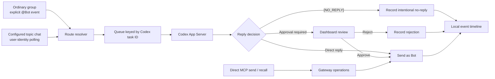

<div align="center">
  
  <h1>Feishu Codex Gateway</h1>
  <p><strong>Turn Feishu conversations into observable, persistent Codex work.</strong></p>
  <p>
    Route ordinary chats, topic threads, images, and Bot commands to the right Codex task—then review every step from a local dashboard.
  </p>

  <p>
    <a href="README.md"><strong>English</strong></a> ·
    <a href="README.zh-CN.md">简体中文</a>
  </p>

  <p>
    <a href="https://github.com/liuyuan0018/lark_codex_gateway/actions/workflows/secret-scan.yml"></a>
    
    
    <a href="LICENSE"></a>
  </p>
</div>

> [!IMPORTANT]
> This gateway is local-first. It stores message content, business IDs, Codex task IDs, and downloaded attachments on the host machine. Keep its configuration and runtime directory private.

## Why this gateway?

Feishu gives teams real conversations; Codex gives those conversations an execution environment. This gateway connects the two while keeping routing, concurrency, reply policy, and failure diagnosis explicit.

| Capability | What it does |
| --- | --- |
| 🧭 Deterministic routing | Maps an ordinary chat or each `chat_id + thread_id` topic to a persistent Codex task. |
| ⚡ Session-level concurrency | Preserves order inside one Codex task while different tasks run in parallel. |
| 🖼️ Attachment-aware input | Downloads Feishu images locally and sends them to Codex as image inputs. |
| 🧠 Context control | Sends only the current message to reused tasks unless the user explicitly asks for earlier chat history. |
| ✋ Reply approval | Holds selected topic replies for dashboard approval; operators can approve or reject them. |
| 🤫 Intentional silence | Records `[NO_REPLY]` as a successful Agent decision instead of looking like a dropped message. |
| 🔍 End-to-end observability | Uses the Feishu `eventId` as the problem ID across receive, queue, Codex, approval, send, and failure stages. |
| ↩️ Bot message recall | Recalls Bot-sent messages through the gateway and records the result. |

## How it works



## Routing rules

| Route | Inbound identity | Requires `@Bot` | Codex task | Reply behavior |
| --- | --- | --- | --- | --- |
| Ordinary chat in `allowedChatIds` | Bot event | Yes, for group messages | Created automatically and reused | Sent immediately |
| Fixed route in `chatRoutes` | Bot event | Yes, for group messages | Existing task from configuration | Sent immediately |
| Topic chat in `topicChatRoutes` | Authorized user polling | No | One task per `chat_id + thread_id` | Approval by default; configurable per route |
| Document comment | Feishu event | Event-dependent | Top-level `threadId` | Sent immediately |

An unknown ordinary group is accepted only when its Bot event explicitly mentions the current Bot. The gateway then adds that `chat_id` to the active private configuration. Unknown groups are never added to user-identity polling.

## Requirements

- macOS or Windows
- Node.js 18 or newer
- Codex CLI and the Codex desktop app
- `lark-cli`, configured for a Feishu/Lark application
- A Feishu Bot that is already a member of every chat it needs to reply to

## Quick start

### 1. Install the Codex Plugin

```bash
codex plugin marketplace add liuyuan0018/lark_codex_gateway --ref main
codex plugin add lark-codex-gateway@lark-codex-gateway
```

Restart the Codex desktop app after adding the marketplace. Use a new Codex task so the installed Skills and gateway tools are loaded.

### 2. Configure Feishu identities

Configure the application and authorize the user on this machine. The user identity reads configured topic chats; the Bot identity sends replies.

```bash
lark-cli config init --new
lark-cli auth login --domain all
```

Do not copy token files from another computer.

### 3. Create the private gateway configuration

Copy [`config.example.json`](config.example.json) to the platform-specific private location and replace every placeholder:

| Platform | Configuration path |
| --- | --- |
| macOS | `~/Library/Application Support/lark-codex-gateway/config.json` |
| Windows | `%APPDATA%\lark-codex-gateway\config.json` |
| Linux | `${XDG_CONFIG_HOME:-~/.config}/lark-codex-gateway/config.json` |
| Development checkout | `config.local.json` |

You may also set `LARK_CODEX_GATEWAY_CONFIG` to an explicit path. On macOS, restrict the file after creating it:

```bash
chmod 600 "$HOME/Library/Application Support/lark-codex-gateway/config.json"
```

### 4. Start through Codex

Open a new Codex task and ask `Show the current Feishu gateway status`. The installed Plugin starts the local gateway when its MCP tool is first used.

Open [http://127.0.0.1:47931](http://127.0.0.1:47931) and confirm that the gateway is connected and polling is running.

To install a later release:

```bash
codex plugin marketplace upgrade lark-codex-gateway
codex plugin add lark-codex-gateway@lark-codex-gateway
```

Restart the Codex desktop app and use a new task after updating.

## Configuration

Start with [`config.example.json`](config.example.json). The most important fields are:

| Field | Purpose |
| --- | --- |
| `codexWorkdir` | Project directory used by Codex. Must exist on the current machine. |
| `codexModel` | Model passed to Codex App Server. |
| `codexReasoningEffort` | Reasoning effort used for new and resumed turns. |
| `allowedChatIds` | Ordinary chats that may enter through explicit Bot events. |
| `commandSenderIds` | Users whose explicit `@Bot` requests must receive a Codex response. |
| `chatRoutes` | Fixed ordinary-chat bindings to existing Codex task UUIDs. |
| `topicChatRoutes` | Topic-chat configuration, including optional project Skill, initialization prompt, and reply approval policy. |
| `pollUserMessages` | Enables user-identity polling for `topicChatRoutes` only. |
| `pollIntervalMs` | Delay between topic-chat polls; defaults to `5000`. |
| `groupContextMessages` | Maximum earlier messages attached when the current message explicitly requests history. |
| `enableDocComments` | Enables document-comment handling; disabled by default. |

### Topic route example

```json
{
  "chatId": "oc_replace_with_topic_chat_id",
  "threadTitlePrefix": "Support topic",
  "replyApprovalRequired": true,
  "skillName": "incident-triage",
  "initializationPrompt": "Act as the support assistant for this chat. Handle one topic per Codex task."
}
```

The configured project Skill must exist at `<codexWorkdir>/.agents/skills/<skillName>/SKILL.md`. A new topic task receives that Skill, the short initialization prompt, and a one-time snapshot of the topic. Later messages reuse the task without repeating old content.

## Dashboard and operations

The loopback dashboard shows:

- gateway, polling, and Codex queue health;
- active Codex tasks and current Feishu event IDs;
- inbound, internal, outbound, ignored, and failed records;
- downloaded attachment counts and sizes;
- pending replies with **Approve** and **Reject** actions;
- one-click copying of the Feishu `eventId` problem ID.

The MCP server exposes tools for status, event search, proactive Bot messages, and Bot-message recall. Proactive operations still enforce `allowedChatIds`, `chatRoutes`, and `topicChatRoutes`.

### Service commands

```bash
node scripts/service.mjs start
node scripts/service.mjs status
node scripts/service.mjs restart
node scripts/service.mjs stop
```

For foreground diagnostics:

```bash
node scripts/run-gateway.mjs
```

## Message context and attachments

- Reused Codex tasks receive only the current Feishu message by default.
- A direct Feishu reply includes the one message it replies to.
- Earlier group or topic history is included only when the current message explicitly asks for it, such as “use the logs above” or `#带上下文`.
- New topic tasks receive a one-time initial snapshot, limited to 32 resources and 250 MiB.
- A message can provide up to eight images, each limited to 20 MiB.
- Downloaded files remain inside the private gateway state directory.

## Provider environment

Before Codex starts, the gateway reads the active `model_provider` and its `env_key` from `~/.codex/config.toml`. If the variable is missing from the gateway process, Windows reads it from the user environment and macOS reads it from `launchctl`. Only the Codex child process receives the value.

Provider keys are never written to gateway configuration, event records, or logs.

## Runtime data and migration

| Platform | Runtime directory |
| --- | --- |
| macOS | `~/Library/Application Support/lark-codex-gateway/` |
| Windows | `%LOCALAPPDATA%\lark-codex-gateway\` |
| Linux | `${XDG_STATE_HOME:-~/.local/state}/lark-codex-gateway/` |

The directory contains local state, traffic history, logs, and downloaded attachments. Do not commit or share it.

For a normal machine migration:

1. Stop the old gateway.
2. Install and authorize `lark-cli` on the new machine.
3. Copy only the private configuration, then update machine-specific paths and Codex task UUIDs.
4. Do not copy `state.json` unless the referenced Codex tasks also exist on the new host.
5. Start the new gateway and keep only one host active for the same Feishu application.

## Security

- The dashboard binds to `127.0.0.1` by default and has no authentication. Never expose it directly to a LAN or the Internet.
- Keep Feishu credentials in `lark-cli`; never put them in this repository.
- Keep private prompts, chat IDs, user IDs, task IDs, message traffic, and downloaded resources out of public issues.
- Run a secret scanner against the complete Git history before publishing a fork.
- If a credential was committed, rotate or revoke it before rewriting Git history.

See [SECURITY.md](SECURITY.md) for reporting guidance.

## Development

Run syntax checks and the local test suite:

```bash
npm --prefix scripts/gateway run check
```

The repository's GitHub workflow scans every push and pull request with Gitleaks.

## License

[MIT](LICENSE)
