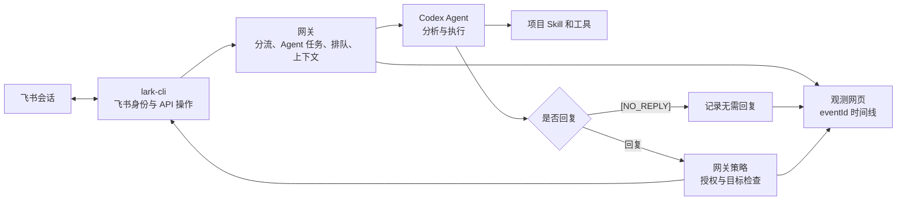

<div align="center">
  
  <h1>飞书 Codex 网关</h1>
  <p><strong>面向飞书会话的 Codex Agent 接入与管理。</strong></p>
  <p>
    提供消息路由、Agent 任务生命周期管理、回复控制和全流程观测。
  </p>

  <p>
    <a href="README.md">English</a> ·
    <a href="README.zh-CN.md"><strong>简体中文</strong></a>
  </p>

  <p>
    <a href="https://github.com/liuyuan0018/lark_codex_gateway/actions/workflows/secret-scan.yml"></a>
    
    
    <a href="LICENSE"></a>
  </p>
</div>

> [!IMPORTANT]
> 网关默认将数据存储在本机。消息正文、业务 ID、Codex 任务 ID 和下载的附件均保存在网关宿主机上。请妥善保护私有配置和运行目录。

## 定位与范围

本插件在飞书会话与 Codex Agent 之间建立受管理的连接。通过统一的消息路由和任务生命周期管理，现有 Agent、Skill 与工具可以服务多个飞书会话。本插件不替代 `lark-cli`，不重复封装通用飞书 API，也不承载特定业务的诊断逻辑。

## 组件职责边界

| 组件 | 职责 |
| --- | --- |
| `lark-cli` | 完成用户和 Bot 身份授权，并提供飞书原子操作：接收和读取消息、下载资源、发送或撤回消息、调用飞书 OpenAPI。 |
| 网关插件 | 将群聊和话题映射到 Codex 任务，管理任务复用与排队，准备消息上下文，控制回复，并使用 `eventId` 记录各处理阶段。 |
| Codex Agent | 识别用户意图，判断是否需要回复，调查请求并执行对应工作。 |
| 项目 Skill 和工具 | 提供特定业务的处理流程与执行能力。业务行为在此定义，不写入网关。 |

网关将飞书操作交由 `lark-cli` 执行。网关提供的发送和撤回工具是受控操作入口，在 `lark-cli` 原子操作之外增加路由限制、回复授权、幂等控制和处理记录。

## 核心职责

| 能力 | 作用 |
| --- | --- |
| 🧭 确定性路由 | 普通群绑定一个任务；话题群默认按 `chat_id + thread_id` 绑定持久 Codex 任务，普通群可用 `sessionScope: "chat"` 共享一个任务。 |
| ⚡ 按任务并发 | 同一个 Codex 任务内保持顺序，不同任务可以并行处理。 |
| 🖼️ 附件输入 | 调用 `lark-cli` 下载飞书资源，并将本地路径作为 Agent 输入。 |
| 🧠 上下文控制 | 复用任务时仅提交当前消息；仅在用户明确要求时附加历史消息。 |
| ✋ 回复授权 | 按照路由配置将回复置于待授权状态，由操作人员批准或拒绝发送。 |
| 🤫 无需回复状态 | Agent 返回 `[NO_REPLY]` 时记录为正常结束状态，以区别于消息过滤或处理失败。 |
| 🔍 全流程观测 | 使用飞书 `eventId` 关联接收、排队、Codex 处理、授权、发送和失败记录。 |
| 🛡️ 重复与冲突保护 | 使用 `messageId` 合并 Bot 事件和用户轮询的同一条消息，并对 Codex 活动写入冲突执行有界退避重试。 |
| ↩️ Bot 操作管理 | 通过 `lark-cli` 发送或撤回 Bot 消息，并由网关执行策略校验和结果记录。 |

## 架构与消息流



## 入站与回复规则

| 路由 | 入站身份 | 群消息是否需要 `@Bot` | Codex 任务 | 回复方式 |
| --- | --- | --- | --- | --- |
| `allowedChatIds` 普通群 | Bot 事件 | 需要 | 自动创建并复用 | 直接发送 |
| `chatRoutes` 固定路由 | Bot 事件 | 需要 | 配置中已有的任务 | 直接发送 |
| `topicChatRoutes` 话题群或显式允许的普通群 | 已授权用户身份轮询用户及其他应用消息 | 不需要 | 默认每个话题/根消息/消息线程一个任务；`sessionScope: "chat"` 时整个群共享一个任务 | 默认网页授权，可按群关闭 |
| 文档评论 | 飞书事件 | 取决于事件 | 顶层 `threadId` | 直接发送 |

陌生普通群只有在 Bot 事件明确 `@Bot` 时才会进入网关。网关会把该 `chat_id` 写入当前私有配置，但不会把陌生群加入用户身份轮询。

## 环境要求

- macOS 或 Windows
- Node.js 18 或更高版本
- Codex CLI 和 Codex 桌面应用
- 已为飞书应用完成配置的 `lark-cli`
- Bot 已加入所有需要回复的群

## 快速开始

### 1. 安装 Codex Plugin

```bash
codex plugin marketplace add liuyuan0018/lark_codex_gateway --ref main
codex plugin add lark-codex-gateway@lark-codex-gateway
```

添加 marketplace 后重启 Codex 桌面应用，并新建一个 Codex 任务，让应用加载 Plugin 中的 Skill 和网关工具。

### 2. 配置飞书身份

在当前机器配置应用并完成用户授权。两种身份都由 `lark-cli` 管理：用户身份读取指定话题群，Bot 身份发送回复。网关不保存这些身份的凭据。

```bash
lark-cli config init --new
lark-cli auth login --domain all
```

不要从另一台机器复制 token 文件。

### 3. 创建私有网关配置

把 [`config.example.json`](config.example.json) 复制到对应平台的私有目录，并替换所有占位内容：

| 平台 | 配置路径 |
| --- | --- |
| macOS | `~/Library/Application Support/lark-codex-gateway/config.json` |
| Windows | `%APPDATA%\lark-codex-gateway\config.json` |
| Linux | `${XDG_CONFIG_HOME:-~/.config}/lark-codex-gateway/config.json` |
| 源码开发目录 | `config.local.json` |

也可以通过 `LARK_CODEX_GATEWAY_CONFIG` 指定其他路径。macOS 创建文件后建议限制权限：

```bash
chmod 600 "$HOME/Library/Application Support/lark-codex-gateway/config.json"
```

插件随附的 MCP 配置使用稳定的跨平台引用 `user://lark-codex-gateway/config.json`，运行时映射到上表对应平台的私有路径。插件进程只固定这个选中的路径，不缓存文件内容。每次调用网关工具时都会重新读取该路径；内容指纹变化后，插件会优雅重启网关并加载新配置。只有修改 `LARK_CODEX_GATEWAY_CONFIG` 或切换配置文件路径时，才需要重启 Codex 插件。

### 4. 通过 Codex 启动

新建一个 Codex 任务并输入“查看当前飞书网关状态”。第一次调用 Plugin 的 MCP 工具时，Plugin 会启动本地网关。

打开 [http://127.0.0.1:47931](http://127.0.0.1:47931)，确认网关已连接且轮询正在运行。

后续版本更新：

```bash
codex plugin marketplace upgrade lark-codex-gateway
codex plugin add lark-codex-gateway@lark-codex-gateway
```

更新后重启 Codex 桌面应用，并使用新任务。

## 配置说明

从 [`config.example.json`](config.example.json) 开始配置。主要字段如下：

| 字段 | 作用 |
| --- | --- |
| `codexWorkdir` | Codex 使用的项目目录，必须存在于当前机器。 |
| `codexModel` | 传给 Codex App Server 的模型。 |
| `codexReasoningEffort` | 新建和恢复任务时使用的推理等级。 |
| `allowedChatIds` | 可以通过明确 Bot 事件进入网关的普通群。 |
| `commandSenderIds` | 这些用户明确 `@Bot` 时，Codex 必须处理并回复。 |
| `chatRoutes` | 把普通群固定绑定到当前机器已有的 Codex 任务 UUID。 |
| `topicChatRoutes` | 配置线程化轮询、普通群显式开关、项目 Skill、初始化提示词、回复授权策略和 `sessionScope`（默认 `thread`，可设为 `chat` 共享整个群的任务）。 |
| `pollUserMessages` | 只为 `topicChatRoutes` 启用用户身份轮询；接收用户和其他应用消息，并排除网关 Bot 自己的消息。 |
| `pollIntervalMs` | 话题群轮询间隔，默认 `5000` 毫秒。 |
| `groupContextMessages` | 当前消息明确要求读取历史时，最多附带多少条更早的消息。 |
| `enableDocComments` | 是否处理文档评论，默认关闭。 |

### 话题群配置示例

```json
{
  "chatId": "oc_replace_with_topic_chat_id",
  "threadTitlePrefix": "值班话题",
  "replyApprovalRequired": true,
  "allowRegularChat": false,
  "sessionScope": "thread",
  "skillName": "incident-triage",
  "initializationPrompt": "你是本群的值班助手。每个话题只处理对应的问题。"
}
```

项目 Skill 必须位于 `<codexWorkdir>/.agents/skills/<skillName>/SKILL.md`。网关创建话题任务时，会写入该 Skill、简短初始化提示词和一次性话题快照；后续消息继续使用同一个任务，不会重复写入旧内容。

## 观测网页与运维

本地网页展示：

- 网关连接、轮询和 Codex 队列状态；
- 正在运行的 Codex 任务和对应飞书事件 ID；
- 入站、内部处理、出站、忽略和失败记录；
- 已下载附件的数量和大小；
- 等待发送的回复，以及**授权发送**和**拒绝授权**按钮；
- 飞书 `eventId` 问题 ID 的一键复制按钮。

MCP 服务提供网关状态、事件搜索、Bot 主动发消息和撤回 Bot 消息等管理工具。发送和撤回仍由 `lark-cli` 执行；网关负责检查 `allowedChatIds` 和路由，并记录操作结果。不需要网关分流或回复管理的通用飞书操作，应直接使用已有的 `lark-cli` Skill。

同一飞书聊天消息即使同时从 Bot 事件和用户轮询到达，也只会处理一次；`eventId` 仍分别保留用于链路追踪。Codex 任务暂时存在活动写入者时，网关会在同一 session 队列内有界重试，耗尽前不会发送失败说明。IM 回复或主动消息遇到明确的 HTTP 429 限流时，网关会复用原幂等键执行有界退避重试，不会重新运行 Codex。网页手动重试会受控地清除该 `messageId` 的已处理记录、创建新的出站幂等域，然后重新进入正常管线。

### 服务命令

```bash
node scripts/service.mjs start
node scripts/service.mjs status
node scripts/service.mjs restart
node scripts/service.mjs stop
```

前台诊断：

```bash
node scripts/run-gateway.mjs
```

## 消息上下文与附件

- 复用 Codex 任务时，默认只发送当前飞书消息。
- 飞书回复消息会附带它直接回复的那一条消息。
- 只有当前消息明确要求时，网关才会补充更早的群聊或话题记录，例如“结合上面的日志”或 `#带上下文`。
- 新话题任务会获得一次性初始快照，最多 32 个资源、总计 250 MiB。
- 单条消息最多处理 8 张图片，每张不超过 20 MiB。
- 下载的文件只保存在网关私有运行目录。

## Codex Provider 环境

启动 Codex 前，网关会读取 `~/.codex/config.toml` 中当前 `model_provider` 及其 `env_key`。如果网关进程没有该变量，Windows 会从用户环境读取，macOS 会从 `launchctl` 读取；网关只把变量值交给 Codex 子进程。

Provider 密钥不会写入网关配置、事件记录或日志。

## 运行数据与机器迁移

| 平台 | 运行目录 |
| --- | --- |
| macOS | `~/Library/Application Support/lark-codex-gateway/` |
| Windows | `%LOCALAPPDATA%\lark-codex-gateway\` |
| Linux | `${XDG_STATE_HOME:-~/.local/state}/lark-codex-gateway/` |

运行目录包含本地状态、消息记录、日志和下载的附件，请勿提交或分享。

迁移到另一台机器时：

1. 停止旧机器上的网关。
2. 在新机器安装并授权 `lark-cli`。
3. 只复制私有配置，并修改机器路径和 Codex 任务 UUID。
4. 除非新机器上也存在被引用的 Codex 任务，否则不要复制 `state.json`。
5. 启动新网关；同一个飞书应用只保留一台网关运行。

## 安全边界

- 网页默认只监听 `127.0.0.1`，并且没有身份认证。不要直接暴露到局域网或互联网。
- 飞书凭据由 `lark-cli` 保存，不要写入本仓库。
- 不要在公开 Issue 中提交私有提示词、群 ID、用户 ID、任务 ID、消息记录或下载的附件。
- 公开 Fork 前，应扫描完整 Git 历史，而不仅是当前文件。
- 如果凭据曾被提交，应先轮换或撤销，再清理 Git 历史。

安全问题反馈方式见 [SECURITY.md](SECURITY.md)。

## 开发与检查

运行语法检查和本地测试：

```bash
npm --prefix scripts/gateway run check
```

仓库中的 GitHub 工作流会在每次 Push 和 Pull Request 时使用 Gitleaks 扫描密钥。

## 许可证

[MIT](LICENSE)
